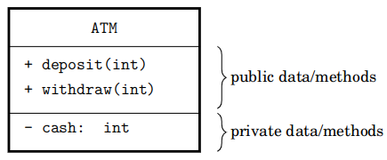
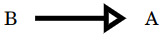
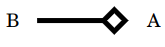
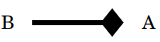
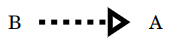
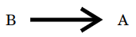

# Introduction

## What's a design pattern?
A design pattern is a tried and true solution to a common problem. Particularly, they provide standard OOP
solutions to common problems while making components of the system reusable.

## Classes of design patterns

Design patterns all achieve different goals but there exist three broad classes of them. *Creational* patterns
deal with object creation mechanisms, *structural* patterns ease the design by identifying a simple way to realise
relationships between entities and *behavioural* patterns are concerned withn communication between objects.
Observer belongs to the behavioural class.

## What problem does the observer solve?

The aim of the observer pattern is to propagate state changes of the object to be observed (subject) into
multiple observer objects. It does this by calling each update method of its observers. 

For example in a program to monitor stocks where the subject stores a list of stock prices. Implementing
the graph view and the tabular view inside the subject itself would make it cluttered and hard to maintain.
It's better to assign the responsibility of observing the price to some UI and tabular view classes and
whenever the price changes they're updated.

More formally, we say that the observer pattern defines a *one-to-many* relationship so that when an object
changes all its dependents are notified automatically when the state of the subject changes.


A concise way to describe the observer is via its UML diagram so before we get into it here's a little
refresher on UML.

# UML basics

## UML blocks

Objects (instances of classes) in UML are visually described by blocks. Their public data and methods
preceeded by `+` and their private ones by `-`. For example, the ATM class has the `deposit(int amount)`,
`withdraw(int amount)` as public methods and `cash` as private data.



UML connects instances by arrows and each arrow has its own meaning.

<table border="1">
   <tr>
    <td>Arrow</td>
    <td>Definition</td>
    <td>C++ example</td>
  </tr>
  
  <tr>
    <td></td>
    <td><i>Inheritance</i></br>B inherits from A, i.e. it inherits its public/private methods and data including their implementation. B is free to overwrite their implementation.</td>
    <td>

```cpp
class A {
public:
  // will be inherited
  int foo() { return 42; }
protected:
  // will be inherited
  unsigned bar() { return 1337; }
private:
  // will not be inherited
};  
class B: public A {
public:
  unsigned bar() { return 0xdeadbeef; }
};
int main() {
  B b;
  b.foo(); // 42
  b.bar(); // 0xdeadbeef
}
```
</td>
  </tr>

  <tr>
    <td></td>
    <td><i>(Weak) aggregation</i></br>B is associated with A but B's lifetime does not necessarily depend on A's -- if B is destroyed, A may still live.</br>Summary: B has but shares an object A.</td>
    <td>
      
```cpp    
#include <iostream>

class A
{
public:
  ~A() { std::cout << "A is destroyed\n"; }
};

class B
{
public:
  B(): obj(nullptr) {};
  ~B() { std::cout << "B is destroyed\n"; }
  void SetA(const A& a) { *obj = a; }
private:
  A* obj;
};

int main() {
  A a;
  bool do_something = true;
  if (do_something) {
    B b;
    b.SetA(a);
  }
  // a is still alive
}
```
</td>
  </tr>

<tr>
    <td></td>
    <td><i>Strong aggregation</i> aka <i>composition</i>.</br>B fully contains A. Composition occurs when a class contains another one as part and lifetime of contained object (A) is tightly bound to the lifetime of the container (B).</br>Summary: B has and owns an object A.</td>
    <td>

```cpp
#include <iostream>

class A {
public:
  A() { std::cout << "A is created\n"; }
  ~A() { std::cout << "A is destroyed\n"; }
  void foo() { std::cout << "A is calling foo\n"; }
};

class B {
public:
  B() { std::cout << "B is created\n"; }
  ~B() { std::cout << "B is destroyed\n"; }
  A a;
private:
};

int main()
{
  B b;
  b.a.foo(); // a exists only within b
}
```
</td>
  </tr>

  <tr>
    <td></td>
    <td><i>Realisation</i></br>B realises A. In this case, A is an interface; all its methods are defined but does not implemented. A's methods are called abstract. B inherits from it and implements its methods</td>
    <td>

```cpp
#include <iostream>

// interface class
class A {
public:
  // abstract (aka virtual) unimplemented methods
  virtual int foo() = 0;
  virtual int bar() = 0;
};

// inherit A and then implement all its methods
class B: public A {
public:
  // implement abstract methods (virtual->override)
  int foo() override { return 42; }
  int bar() override { return 1337; }
};

int main() {
  B b;
  std::cout << b.foo() << std::endl;
  std::cout << b.bar() << std::endl;
}
```
</td>

  <tr>
    <td></td>
    <td><i>Association</i></br>Class B has a connection to class A.  Association is a broad term to represent the "has-a" relationship between two classes. It means that an object of one class somehow communicates to an object of another.</br>Summary: B has an object A.<td>

```cpp
class A {
public:
  int foo() { return 420; }
};

class B {
public:
  B(A& a): a_(a) {};
  int bar() { return a_.foo(); }
private:
    A& a_; // has-a reference
};

int main() {
  A a;
  B b(a);
  b.bar(); // a.foo()
}
```
</td>
  </tr>
</table>

